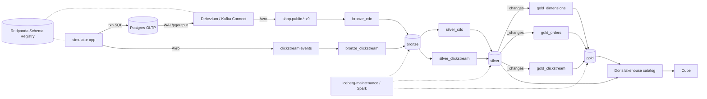

<!-- markdownlint-disable -->
# Spec: OLTP + CDC + Lakehouse Redesign

**Date:** 2026-09-25 · **Status:** Approved · **Source:** [intent.md](intent.md)

Pinned platform versions (unchanged unless stated): Flink 1.18.1, Iceberg 1.6.1 (`iceberg-flink-runtime-1.18`), Nessie 0.108.2, Redpanda v23.3.6, Postgres 15.6, Doris 4.1.3, Flyway 10.10.

## Functional Requirements

**FR-1 · OLTP application (simulator)**
- FR-1.1 Postgres holds exactly 9 tables: `customers`, `addresses`, `categories`, `products`, `inventory`, `orders`, `order_items`, `payments`, `shipments`. No serving/analytical tables.
- FR-1.2 All writes go through domain use cases, each one Postgres transaction: `register_customer`, `update_customer_contact`, `add_address`, `set_primary_address`, `forget_customer`, `create_product`, `change_price`, `discontinue_product`, `restock`, `place_order`, `pay_order`, `fail_payment`, `ship_order`, `deliver_order`, `cancel_order`, `refund_order`.
- FR-1.3 Order state machine: `created → paid → shipped → delivered`. `cancelled` is reachable from `created`/`paid`. `refunded` is reachable from `delivered`. Invalid transitions raise a domain error and roll back.
- FR-1.4 `place_order` atomically inserts `orders` + N `order_items` (1–5) and decrements `inventory`; it fails (rolls back) when stock is insufficient. `cancel_order` restocks in the same transaction; `refund_order` does not.
- FR-1.5 `orders.session_id` (nullable) links an order to the clickstream session that produced it.
- FR-1.6 Async progression via workers polling Postgres (`SELECT … FOR UPDATE SKIP LOCKED` on status + age). Delays are expressed in simulated days and scaled by `TIME_SCALE` (default `1 day = 60 s`). Probabilities are configurable (defaults: payment decline 5% with retry, cancel before ship 3%, refund after delivery 2%, 70% `begin_checkout → place_order`).
- FR-1.7 Restart-safe: all progression state lives in Postgres. IDs are UUIDs (no in-memory counters).
- FR-1.8 First boot seeds categories, ~60 products with inventory, and ~200 customers through the same use cases when the DB is empty. There is no retroactive history.
- FR-1.9 Clickstream is produced to Redpanda topic `clickstream.events` (key `session_id`), with event types `page_view`, `add_to_cart`, `remove_from_cart`, `begin_checkout`. ~30% of sessions start anonymous (`customer_id = null`, `anonymous_id` set) and gain `customer_id` on login/checkout within the same session.

**FR-2 · CDC**
- FR-2.1 Postgres runs with `wal_level=logical`, a dedicated `REPLICATION` user, and a `PUBLICATION` restricted to the 9 tables. All tables use `REPLICA IDENTITY DEFAULT`.
- FR-2.2 Debezium Postgres connector (`pgoutput`) runs on Kafka Connect. Topics are `shop.public.<table>`, keyed by PK, Avro via the Redpanda Schema Registry, with a heartbeat enabled. The connector is registered by an init container.
- FR-2.3 Topic retention is 7 days for CDC and clickstream.

**FR-3 · Lakehouse layers** (Iceberg v2, Nessie `main`, namespaces `bronze`/`silver`/`gold`)
- FR-3.1 **Bronze** (`bronze_cdc`, `bronze_clickstream` jobs): one append-only table per source topic, `bronze.cdc_<table>` and `bronze.clickstream_events`.
  - CDC rows carry `op`, flattened `before_*`/`after_*` columns, `_source_lsn`, `_source_tx_id`, `_source_ts`, and `_kafka_partition`/`_kafka_offset`/`_ingested_at`.
  - PII columns are replaced by HMAC-SHA256 before write (FR-5).
- FR-3.2 **Silver** (`silver_cdc`, `silver_clickstream` jobs). This layer is source-aligned only: typing, naming, dedup, changelog application, quarantine.
  - `silver.<table>_changes` is append-only: typed, deduplicated on `(pk, _source_lsn)`, with snapshot `op=r` treated as an upsert. **Gold streams only from these.**
  - `silver.<table>` holds current state (upsert on PK) with `_is_deleted`, `_source_lsn`, `_updated_at`. It is for ad hoc queries only and is never streamed.
  - `silver.clickstream_events` receives valid events; `silver.clickstream_quarantine` receives invalid events plus a `_reject_reason`.
- FR-3.3 **Gold** (`gold_dimensions`, `gold_orders`, `gold_clickstream` jobs):
  - `dim_customer` (SCD2: status, primary-address city/state), `dim_product` (SCD2: price, status, category), `dim_date` (static, generated once).
  - `fct_orders` (accumulating snapshot: per-status timestamps + stage durations), `fct_order_items` (FK to the `dim_product` version valid at order time), `fct_payments` (one row per attempt).
  - `sessions` (sessionization, 30 min gap, anonymous→customer stitching), `funnel_1m` (closes on real `orders` via `session_id`, including cart abandonment), `customer_360`.
- FR-3.4 Layers are chained. Only bronze jobs read Redpanda; silver reads bronze and gold reads silver `_changes`, via Iceberg streaming reads.

**FR-4 · Serving**
- FR-4.1 Doris keeps only the `lakehouse` Iceberg catalog; the `postgres` JDBC catalog is removed.
- FR-4.2 Cube models are rewritten on the new gold (`lakehouse.gold`).

**FR-5 · Governance**
- FR-5.1 PII columns (`customers.email`, `customers.phone`, `customers.document`, `addresses.street`, `addresses.number`, `addresses.zip_code`) are HMAC-SHA256(`PII_HMAC_KEY`) in bronze and never stored in clear text in the lakehouse. City/state stay in clear text (they are analytical dimensions).
- FR-5.2 `forget_customer` anonymizes (nulls PII) and soft-deletes (`status='deleted'`). Downstream sees only hashes.

**FR-6 · Operations**
- FR-6.1 An Iceberg maintenance container (Spark 3.5 + `iceberg-spark-runtime-3.5_2.12:1.6.1` + Nessie) loops every 15 min over all tables: `rewrite_data_files` (target 128 MB, `partial-progress.enabled`), `rewrite_position_delete_files`, `expire_snapshots` (older than 24 h), and `remove_orphan_files` (older than 24 h).
- FR-6.2 Minimum 12 GB RAM, documented. `make up-lite` excludes Doris, Cube, and maintenance.

## Design / Architecture Decisions

### Topology

### OLTP schema (Flyway `V1__oltp_schema.sql`, replaces V1–V3)

| Table | Key columns (beyond PK `uuid`) |
|---|---|
| `customers` | `email`, `phone`, `document`, `full_name`, `status` (`active`/`inactive`/`deleted`), `created_at`, `updated_at` |
| `addresses` | `customer_id` FK, `street`, `number`, `city`, `state`, `zip_code`, `is_primary`, timestamps |
| `categories` | `name`, `parent_id` self-FK |
| `products` | `sku` unique, `name`, `category_id` FK, `price NUMERIC(10,2)`, `status` (`active`/`discontinued`), timestamps |
| `inventory` | `product_id` PK/FK, `quantity CHECK (>= 0)`, `updated_at` |
| `orders` | `customer_id` FK, `session_id` null, `status` + CHECK, `total NUMERIC(12,2)`, `created_at`, `paid_at`, `shipped_at`, `delivered_at`, `cancelled_at`, `refunded_at` |
| `order_items` | `order_id` FK, `product_id` FK, `quantity`, `unit_price`, `line_total` |
| `payments` | `order_id` FK, `attempt`, `method`, `amount`, `status` (`approved`/`declined`), `created_at` |
| `shipments` | `order_id` FK unique, `carrier`, `tracking_code`, `shipped_at`, `delivered_at` |

The state machine is enforced in the domain layer. A `CHECK` on `orders.status` values provides defence in depth.

### Simulator module layout (`services/simulator/src/simulator/`)

- `domain/`: pure state machine and rules (no I/O).
- `usecases/`: transactional functions taking a `psycopg` connection.
- `workers/`: pollers that advance orders.
- `traffic/`: session/clickstream generator that calls use cases.
- `producers/`: Avro clickstream producer (`confluent-kafka` + `AvroSerializer`; `.avsc` under `schemas/`).
- `seed.py`, `config.py` (`TIME_SCALE`, probabilities), `main.py` (the single process loop).

`kafka-python` is removed.

### CDC / registry

- A `kafka-connect` service runs on `quay.io/debezium/connect` (2.7.x, pinned). Confluent `kafka-connect-avro-converter` jars are added in a small Dockerfile, pointed at Redpanda's Schema Registry (`broker:8081`, now exposed). Subject strategy: `TopicNameStrategy`. `decimal.handling.mode=precise`, `time.precision.mode=adaptive_time_microseconds`, `tombstones.on.delete=false`.
- The Confluent Avro converter is under the **Confluent Community License** (free, no key, source-available rather than OSI), which was accepted by the owner. It is required because Flink's `debezium-avro-confluent` format and Redpanda's registry both speak the Confluent wire/API. This is recorded in the new CDC ADR.
- Flink gains the `flink-sql-avro-confluent-registry-1.18.1` jar. Bronze reads CDC with `format = 'avro-confluent'` against the raw Debezium envelope, so `op`/`before`/`after`/`source` stay as plain columns (append-only). It deliberately does not use `debezium-avro-confluent`, which would turn the stream into a changelog and collapse the envelope.

### Silver mechanics (resolves ordering)

- The Iceberg streaming source does not guarantee per-key order across splits. Silver therefore never relies on arrival order.
  - `_changes` is written append-only with dedup on `(pk, _source_lsn)`.
  - Current state is computed as Top-1 `ROW_NUMBER() OVER (PARTITION BY pk ORDER BY _source_lsn DESC)` and written to an Iceberg upsert table (`PRIMARY KEY … NOT ENFORCED`, `write.upsert.enabled=true`, unpartitioned or `bucket(pk)` so the partition key is inside the PK).
- Gold reads `_changes` with `/*+ OPTIONS('streaming'='true','monitor-interval'='10s') */`. `_changes` are append-only, so the Iceberg streaming limitation on overwrite snapshots does not apply.
- Event time is `_source_ts` (Debezium `source.ts_ms`), with `table.exec.source.idle-timeout = 30 s`.

### Gold mechanics

- **`fct_orders`**: a streaming `GROUP BY order_id` over `orders_changes`, `MAX(CASE WHEN status = … THEN _source_ts END)` per stage plus the latest attributes by LSN. This is order-independent, and the upsert goes to Iceberg keyed by `order_id`.
- **SCD2** (`dim_customer`, `dim_product`): each change creates a version row keyed `(id, valid_from = _source_ts)`. `valid_to` = `MIN(valid_from)` of later versions of the same id (streaming self-join + aggregation, order-independent). `is_current = valid_to IS NULL`. `dim_customer` combines customer + primary-address versions (a version on either side starts a new customer version). State is unbounded and accepted at this scale (≈200 customers / 60 products); TTL is not set.
- **`fct_order_items` → `dim_product`**: an event-time temporal join (`FOR SYSTEM_TIME AS OF order_created_at`) against a versioned view over `products_changes`.
- **`sessions`**: session window (30 min gap) on `silver.clickstream_events` by stable `session_id`; `anonymous_id` is retained only for anonymous-to-customer stitching. `customer_id` is the last non-null value in the session (stitching).
- **`funnel_1m`**: session-level funnel state associates each order with its corresponding checkout/session before aggregation and emits the resulting status into the appropriate 1 min reporting window; `abandoned = checkouts − orders` is computed from those associated session outcomes.

### Contracts (ODCS v3 only)

- One tree: `contracts/{bronze,silver,gold}/<table>.odcs.yaml`, one loader (`services/flink-jobs/src/contracts.py`, merging `common.py` contract helpers and deleting `contracts/loader.py`). The Data Contract Specification files are removed. `services/flink-jobs/contracts/` is removed.
- The contract drives the silver/gold DDL (ADR-0008 kept). The bronze contract declares topic + subject and expected columns, and a CI test compares it with the Avro schema.

### Flink jobs

7 jobs, each a `StatementSet`: `bronze_cdc`, `bronze_clickstream`, `silver_cdc`, `silver_clickstream`, `gold_dimensions`, `gold_orders`, `gold_clickstream`.
- Transformation SQL lives in pure functions (`sql/<layer>/<table>.py` returning SQL strings), which are reused by the jobs and the batch tests.
- The PII HMAC is a PyFlink Python scalar UDF (`hmac_sha256(value)`), with the key from `PII_HMAC_KEY`.
- `submit_jobs.py` `JOBS` list becomes these 7.
- Flink-to-Postgres JDBC sinks and the `flink-connector-jdbc` and `postgresql` jars are removed.

### Docs / ADRs

- **New ADRs:** 0012 real CDC via Debezium + Avro/Schema Registry (supersedes 0010); 0013 bronze as replay log and chained layers (amends 0003); 0014 silver boundary + `_changes` pattern (amends 0009); 0015 PII hashed at the bronze edge; 0016 Iceberg maintenance via Spark.
- **Updated ADRs:** 0008 (single ODCS standard) and 0011 (Doris is the lakehouse query engine, with no OLTP federation).

## Edge Cases & Error Handling

- **Debezium snapshot vs. app seed on first boot.** `snapshot.mode=initial`. If the connector starts after the seed, rows arrive as `op=r`; otherwise as `op=c`. Silver treats `r` as an upsert and dedups on `(pk, lsn)`. Either ordering converges.
- **Replication slot.** It lives in the Postgres volume, so `make down` (`-v`) drops it. Stopping Connect for a long time grows WAL; the runbook documents `pg_replication_slots` monitoring and `max_slot_wal_keep_size = 1GB`.
- **Duplicate delivery** (Connect restart, at-least-once) is removed by the `(pk, _source_lsn)` dedup in silver. Bronze keeps the duplicates (raw).
- **Deletes.** `op=d` has only the PK in `before` (`REPLICA IDENTITY DEFAULT`). Silver sets `_is_deleted=true` and keeps the last known attributes from prior versions.
- **Schema evolution** (e.g. `ALTER TABLE ADD COLUMN`). A new registry version with a nullable/defaulted field is backward compatible. Bronze needs a contract update + DDL `ADD COLUMN` (demoed by the rewritten `schema-evolution-demo.sh`). An incompatible change fails the bronze job (fail-fast); runbook recovery: update contract → restart from bronze offsets.
- **Poison messages.** Producers are registry-validated, so Avro deserialization errors fail the job (no silent skip). Semantic failures in clickstream (unknown `event_type`, future/stale timestamps > 7 days, missing `session_id`) go to quarantine. CDC relies on OLTP constraints and has no quarantine.
- **Insufficient stock** rolls back `place_order`. The traffic generator records a "stockout" (logged, not a clickstream event), and a restock worker replenishes below a threshold.
- **Concurrent workers** use `FOR UPDATE SKIP LOCKED`, so a simulator restart mid-transaction resumes without double transitions.
- **Maintenance vs. Flink commits.** Iceberg's optimistic concurrency means a rewrite that conflicts with a Flink commit fails validation and is retried next cycle. `partial-progress` limits wasted work. Flink commits are never blocked.
- **Late / idle partitions.** Idle-timeout keeps watermarks moving when a topic is quiet (e.g. `categories`).

## Security / Compliance Considerations

- PII never lands in the lakehouse in clear text (FR-5). `PII_HMAC_KEY` comes from `.env` (the `.env.example` placeholder is documented as dev-only). Rotating the key breaks joins and continuity on hashed columns, so rotation is out of scope and documented.
- The OLTP is unreachable from BI (the Doris `postgres` catalog is removed). The Debezium user has only `REPLICATION` + `SELECT` on the published tables.
- Redpanda retention (7 days) and snapshot expiry (24 h) bound where historical clear-text could otherwise linger. There is none by design.
- Secrets stay in `.env`; no new secrets are committed.

## Testing Approach

- **Simulator domain:** pytest against real Postgres (service container in CI; Testcontainers locally). State machine transitions, transactional inventory, restart resume, and seeding idempotence.
- **Flink SQL logic:** local PyFlink **batch** tests that feed `VALUES` tables into the same SQL functions the jobs use. Cases: dedup `r`+`c`, current state after out-of-order `c/u/d`, SCD2 version closing, accumulating snapshot timestamps, temporal join version pick, sessionization + stitching, and HMAC determinism.
- **Contracts:** ODCS schema validation, and a bronze contract ↔ Avro schema equivalence check (Avro schemas generated from `.avsc` / committed fixtures).
- **E2E (nightly/manual workflow):** `make up`, then after N minutes assert that each gold table is non-empty and consistent in Doris (e.g. `fct_orders` delivered count > 0, funnel orders ≤ checkouts).
- **Ruff** becomes blocking for new code paths.

## Open Questions Resolved

| intent.md question | Resolution |
|---|---|
| Flink streaming-read ordering for SCD2 / accumulating snapshot | Resolved by design: every silver/gold computation is order-independent (dedup/Top-1 by `_source_lsn`, `MAX` per stage, self-join for `valid_to`). |
| Maintenance vs. streaming writers | Resolved: Iceberg optimistic concurrency + retry next cycle + `partial-progress`. Flink commits are unaffected. |
| Debezium snapshot vs. seed ordering; slot cleanup | Resolved: both orderings converge via `r` = upsert + dedup. The slot lives in the volume; `max_slot_wal_keep_size` bounds WAL. |
| HMAC secret management | Resolved: `.env` `PII_HMAC_KEY`, no rotation (documented). |
| Doris 4.x reading equality deletes | **Still open.** Validated by a spike at the start of phase 3 (read a silver upsert table from Doris). Fallback: maintenance applies deletes more aggressively, or Doris reads via a view over `_changes` with Top-1. |
| Driver / deadline | **Still open** (owner chose not to specify). Does not block the design. |
| *New:* Confluent Community License for the Avro converter | Resolved: accepted by the owner (2026-09-25). Free, no license key; recorded in ADR-0012. |
