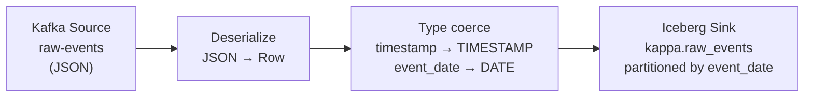
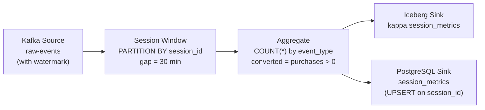
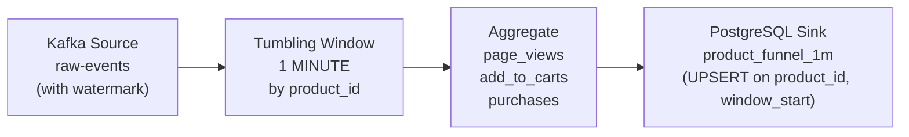

# Flink Jobs — DAG Reference

Three PyFlink jobs implement the Kappa pipeline. Each reads from the same Kafka topic (`raw-events`) but computes different projections.

---

## 1. Raw Event Ingestion (`raw_event_ingestion.py`)

Writes every raw event to the Iceberg lake — the durable, time-travelable record of all activity.



**Operator details:**

| Operator | Type | Notes |
|----------|------|-------|
| KafkaSource | Source | `scan.startup.mode = latest-offset` (or `earliest-offset` with `--from-beginning`) |
| JSON deserializer | Map | `json.ignore-parse-errors = true` — malformed events are dropped, not failed |
| Type coerce | Map | ISO-8601 string → `TIMESTAMP(3)`, derive `event_date` for partition pruning |
| IcebergTableSink | Sink | Exactly-once via Flink checkpoint + Iceberg transactional commit |

**Checkpoint:** 30s interval, EXACTLY_ONCE mode, stored in MinIO `s3://flink-checkpoints/`.

---

## 2. Session Aggregation (`session_aggregation.py`)

Computes per-user session metrics using Flink's **session windows** (gap-based, not fixed size). A session closes when a user is inactive for 30 minutes.



**Operator details:**

| Operator | Type | Notes |
|----------|------|-------|
| KafkaSource | Source | Watermark = event `timestamp` − 5s (allows late events up to 5s) |
| SESSION window | Window | `INTERVAL '30' MINUTE` gap; closes when user is idle |
| Aggregate | Agg | session_start, session_end, duration, page_views, add_to_carts, purchases, converted |
| IcebergTableSink | Sink | Partitioned by `session_date` |
| JdbcSink | Sink | PostgreSQL UPSERT; `sink.buffer-flush.max-rows = 100` for throughput |

**Idempotency:** PostgreSQL sink uses primary key `session_id`; re-running with `--from-beginning` produces the same rows, not duplicates.

---

## 3. Product Funnel (`product_funnel.py`)

Computes funnel metrics per product per **1-minute tumbling window** — a fixed-size time slice that closes at wall-clock minute boundaries.



**Operator details:**

| Operator | Type | Notes |
|----------|------|-------|
| KafkaSource | Source | Same watermark strategy as session job |
| TUMBLE window | Window | `INTERVAL '1' MINUTE`; emit on window close |
| Aggregate | Agg | COUNT per event_type, window_start, window_end |
| JdbcSink | Sink | `sink.buffer-flush.interval = 5s` — slight buffer for micro-batch efficiency |

**Why no Iceberg sink here?** The product funnel is an aggregate, not raw data. PostgreSQL is the serving store; the raw events in `kappa.raw_events` allow recomputing funnel metrics at any granularity via DuckDB queries.

---

## Running Jobs Manually

All jobs accept a `--from-beginning` flag to replay from Kafka offset 0:

```bash
# Run inside the Flink cluster container
docker compose -f infra/docker-compose.yml exec jobmanager \
    python3 /opt/jobs/raw_event_ingestion.py --from-beginning

docker compose -f infra/docker-compose.yml exec jobmanager \
    python3 /opt/jobs/session_aggregation.py --from-beginning --session-gap-minutes 30

docker compose -f infra/docker-compose.yml exec jobmanager \
    python3 /opt/jobs/product_funnel.py --from-beginning --window-minutes 1
```

Or use `make reprocess` which handles teardown and restart automatically.
