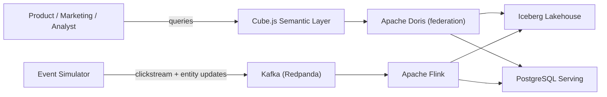
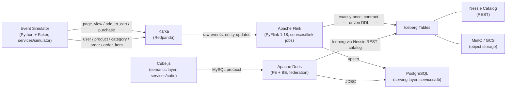
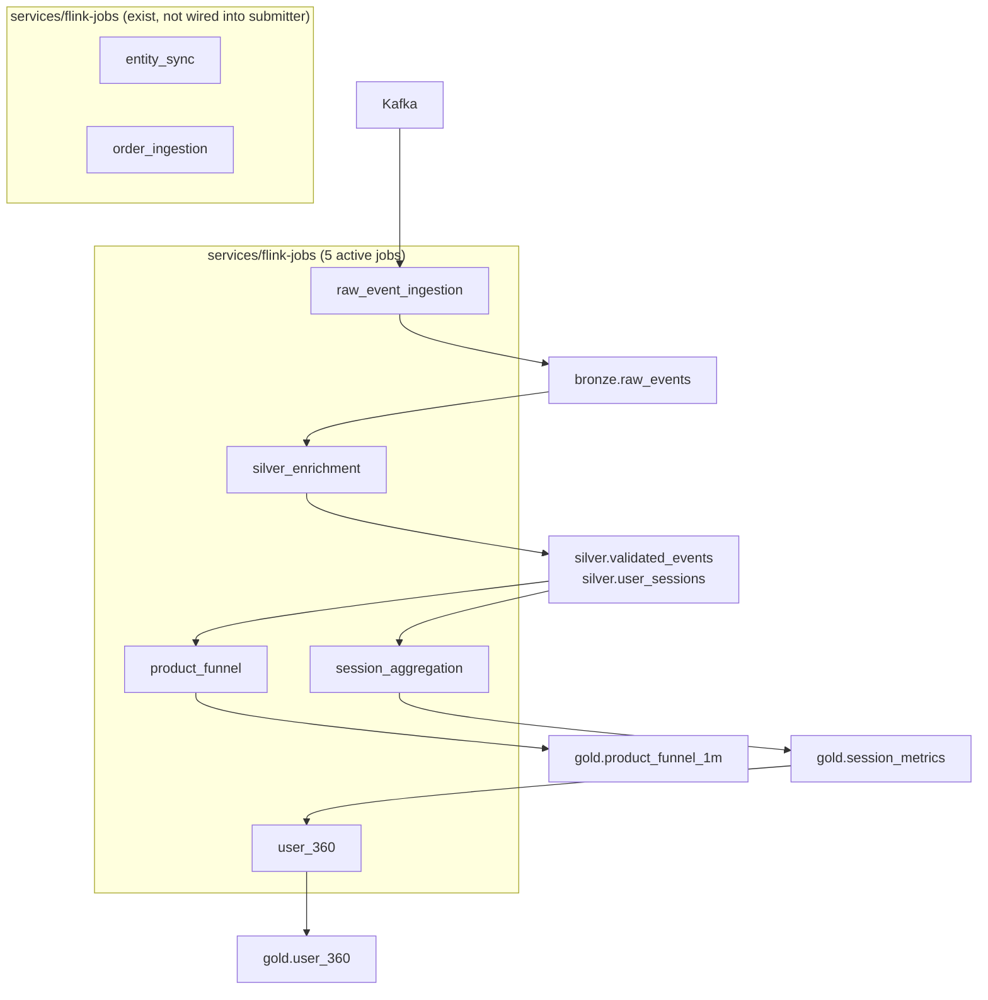

<!-- markdownlint-disable -->
# RFC-0002 - Arquitetura

- **Status:** Accepted
- **Autor:** Tiago Ribeiro Navarro de Andrade
- **Criado em:** 2026-07-19
- **Última atualização:** 2026-07-19
- **Versão:** 1.0

---

## Context Diagram

## Container Diagram

## Component Diagram

## Fluxos

**Fluxo de dados:** `simulator → Kafka (raw-events, entity-updates) → Flink jobs → Iceberg (bronze/silver/gold) + PostgreSQL (upserted serving tables) → Doris (federated query) → Cube.js (semantic API) → BI/analyst`.

**Fluxo de execução:** `make up` starts all services via `infra/compose/docker-compose.yml`; `infra/job-submitter` submits the 5 active jobs to the Flink JobManager on startup; the simulator (`services/simulator`) continuously produces synthetic events; jobs run continuously with `EXACTLY_ONCE` checkpointing every 30s.

## Tecnologias

Redpanda (Kafka-API), PyFlink 1.18.1, Project Nessie (REST catalog), MinIO (S3-compatible, GCS-swappable via `STORAGE_BACKEND`), Apache Iceberg, Apache Doris (FE+BE), Cube.js, PostgreSQL 15.6 (migrated via Flyway). Rationale for each major choice is in the corresponding ADR — see `adr/0003-*.md` through `adr/0011-*.md`.

## Dependências

Docker Compose orchestrates all services with healthcheck-gated startup order (`depends_on: condition: service_healthy`). `infra/job-submitter` depends on the Flink JobManager and Kafka being healthy before submitting jobs. Doris depends on static container IPs for its own internal gossip protocol (not a security measure — see `rfcs/RFC-0006-security.md`).

## Interfaces

- **Kafka topics:** `raw-events` (clickstream), `entity-updates` (wide-schema CDC for dimension/fact entities) — see `rfcs/RFC-0005-api.md`.
- **Flink REST API** (`:8081`) — job control, used by `infra/job-submitter`, `scripts/healthcheck.sh`, `scripts/reprocess.sh`.
- **Doris MySQL protocol** (`:9030`) — federated SQL surface for Cube.js and direct analyst queries (`examples/queries/*.sql`).
- **Cube.js API** (`:4000`) — REST/SQL semantic API + Playground.
- **Nessie REST API** — Iceberg catalog operations, also used for schema-evolution and time-travel demos.
