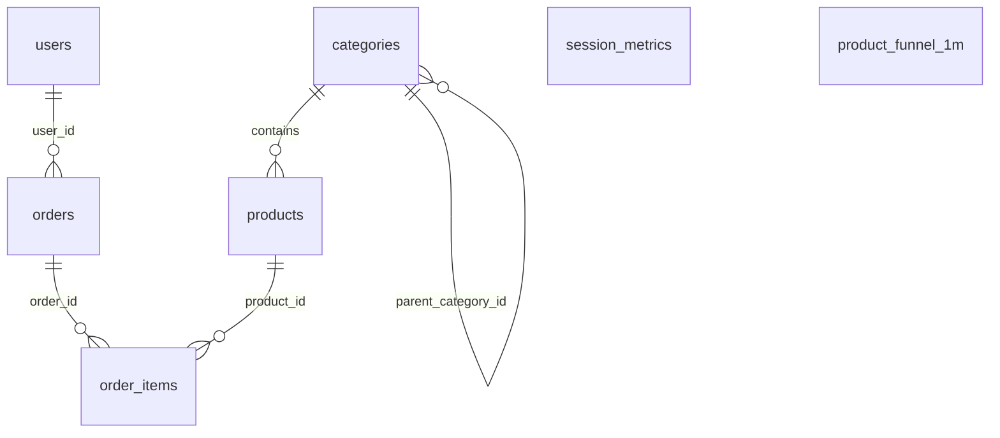

<!-- markdownlint-disable -->
# RFC-0004 - Modelo de Dados

- **Status:** Accepted
- **Autor:** Tiago Ribeiro Navarro de Andrade
- **Criado em:** 2026-07-19
- **Última atualização:** 2026-07-19
- **Versão:** 1.0

---

## Modelo Relacional

PostgreSQL serving layer (migrated via Flyway, `services/db/migrations/`), star schema:

- `session_metrics` — PK `session_id`.
- `product_funnel_1m` — PK (`product_id`, `window_start`).
- `categories` / `users` / `products` / `orders` / `order_items` — star schema with real foreign keys and indexes (Flyway `V3__create_ecommerce_entities.sql`).

## Eventos

Two Kafka topics carry all events (`raw-events`, `entity-updates`) — see `rfcs/RFC-0005-api.md` for the contract-level detail.

## Schemas

Two **distinct** contract standards coexist in this bundle — worth calling out explicitly rather than conflating them:

1. **Data Contract Specification 1.1.0** (datacontract.com format) — used for the medallion layer contracts under `contracts/{bronze,silver,gold}/`:
   - `bronze.raw_events` — event_id, event_type (enum), user_id, session_id, product_id (nullable), event_timestamp(6), metadata (json), event_date (partition key). SLA: 99.9% availability, 5-minute freshness.
   - `silver.validated_events` — adds page_url/referrer (extracted from the metadata JSON) and ingestion_ts; drops malformed/future/>7-day-old events.
   - `silver.user_sessions` — session boundaries (30-min gap), session_start/end, event_count.
   - `gold.session_metrics`, `gold.product_funnel_1m`, `gold.user_360` — full column definitions live in their respective contract YAMLs under `contracts/gold/`.
2. **ODCS (Open Data Contract Standard)** — used specifically for `services/flink-jobs/contracts/raw_events.contract.yaml`, which is genuinely load-bearing at runtime: `services/flink-jobs/src/common.py`'s `load_contract` / `kafka_source_ddl_from_contract` / `iceberg_sink_ddl_from_contract` build the Flink SQL DDL dynamically from this file. Changing the contract changes the running job's DDL — this is schema-driven configuration, not documentation-only.

## Versionamento

Medallion contracts are versioned as part of their Data Contract Specification documents (each has its own contract file per table). The ODCS raw-events contract is versioned as a single file whose changes directly affect job behavior — any change to it should go through review as if it were code, since it functionally is.

## Migrações

PostgreSQL schema migrations are managed by Flyway (`services/db/migrations/V1__*.sql` … `V3__*.sql`). Iceberg schema evolution is additive-only in current usage (`ALTER TABLE ADD COLUMN`, demonstrated in `scripts/schema-evolution-demo.sh`) — old rows return `NULL` for new columns without a file rewrite, per Iceberg's schema evolution guarantees.
